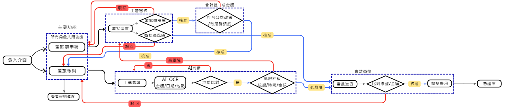

# 💼 HR 差旅自動報銷系統

本專案為一個網頁版差旅報銷系統，旨在將傳統人工報銷流程數位化，透過規則判斷與流程分流，提升企業審核效率並降低錯誤率。

---

## 🎯 專案目標

優化傳統報銷流程中以下問題：
- 流程繁瑣、耗時
- 人工審核容易出錯

透過系統化設計，使報銷流程自動化與標準化。

---
## 🏗 系統架構圖

---

## 🧩 系統流程
### 1️⃣ 報銷申請階段
使用者提交報銷申請單（包含：金額、類別、用途、憑證等）

系統進行初步檢查：
- 是否符合公司規定金額

---

### 2️⃣ 申請審核（主管）
系統判斷報銷申請是否符合基本公司規範後，進入主管審核

---

### 3️⃣ 出差 / 任務執行階段
使用者完成出差或任務執行

---

### 4️⃣ 報銷填寫階段
使用者提交正式報銷單（含實際花費與憑證）

---

### 5️⃣ 風險評估機制（核心邏輯）

系統根據以下條件進行風險分級：

#### 🔴 高風險條件：
- 實際金額 > 申請金額
- 超過公司規範上限（依類別）
- 憑證不一致或缺失
- 地點 / 時間明顯不合理

👉 流程：主管審核 → 會計審核

---

#### 🟢 低風險條件：
- 符合申請金額
- 憑證完整且一致
- 符合公司規範

👉 流程：直接會計審核

---

### 6️⃣ 完成報銷流程
會計確認後，完成整體報銷審核流程
---

## 🔧 使用技術

- HTML（前端畫面）
- CSS（樣式設計）
- JavaScript / Python（系統邏輯）
- Flask（後端）

---

## 💡 專案亮點

- 模擬企業實際報銷流程設計
- 建立風險評估與條件式分流邏輯
- 前端表單互動設計
- 將業務需求轉換為系統規則（Business Logic）

---

## 🚧 專案狀態

目前為 MVP 開發階段：
- ✔ 已完成基本流程與邏輯設計
- 🔧 持續優化 UI 與系統架構
