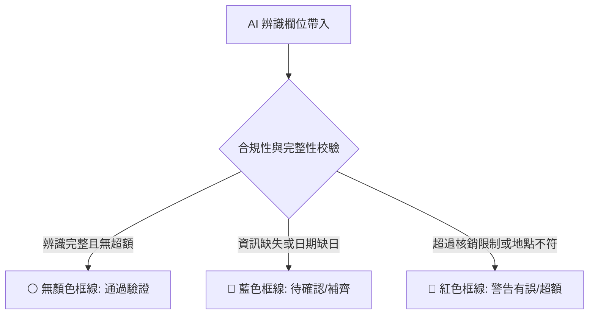

# 📘 HR 差旅報銷暨 AI 憑證辨識系統 - 使用者與管理員操作手冊

本手冊旨在引導**一般員工**、**部門主管**及**財務會計**熟悉本系統之各項功能與升級後的全新排版。系統已整合 AI 憑證辨識 (YOLO + PaddleOCR) 與智慧風控審計後台。

---

## 🚀 系統快速啟動指南

為了簡化啟動流程並加強安全性，系統已將啟動入口進行徹底分流：

| 啟動指令檔 | 適用角色 | 啟動效果 |
| :--- | :--- | :--- |
| **`start_all.bat`** | **全體員工 / 主管 / 會計** | 1. 在背景靜默啟動所有微服務。 2. 自動在瀏覽器打開報銷主系統：`http://127.0.0.1:3000`。 |
| **`start_admin.bat`** | **系統管理員 / 風控稽核人員** | 1. 啟動背景服務。 2. 自動在瀏覽器僅打開風控後台：`http://127.0.0.1:5001`。 *(前台選單已完全隱藏此入口，防範一般員工窺探)* |

> [!TIP]
> 啟動後，所有的後台服務（AI 辨識及風控）均會在同一個命令提示字元視窗下以子進程常駐，關閉視窗或按 `Ctrl+C` 即可一次性安全關閉所有服務。

---

## 👥 角色權限與測試帳號
| 測試帳號 (Email) | 預設密碼 | 角色權限 | 可存取專區 |
| :--- | :--- | :--- | :--- |
| `0000001s` | `password123` | **員工乙 (Employee)** | 申請出差、上傳發票報銷、進度追蹤、憑證檔案庫。 |
| `0000001m` | `password123` | **主管甲 (Manager)** | 部門預算審核、高風險報銷單初審、個人報銷。 |
| `0000001a` | `password123` | **會計丙 (Accountant)** | 預算覆核、所有報銷單終審撥款、憑證稽核。 |
| `admin` | `admin123` | **管理員 (Admin - 風控)** | 專屬登入風控後台 (Port 5001) 進行高風險案件特徵模型審計。 |

---

## 📝 核心功能一：出差前申請與草稿暫存

員工在出差前，必須先至系統提交出差目的地、日期及各科目的預估預算。

### 1. 填寫出差申請
*   路徑：側邊欄 **【差旅報銷中心】** ➡️ 點選 **【開始新的差旅申請】**。
*   填寫目的地、出差事由，並輸入「住宿費」、「交通費」、「伙食費」、「雜費」之預估預算。
*   可選擇點選「儲存草稿」或直接「送出申請」。

### 2. 斷線與防刷新暫存功能 (localStorage)
*   **功能**：為防止瀏覽器意外關閉、斷電或重整導致已輸入的數據遺失，系統會在您修改任何輸入欄位時，**自動在瀏覽器儲存草稿**。
*   **還原**：重新整理頁面或重新進入該表單時，系統將彈出提示並**完全還原**先前的所有填寫內容與明細。
*   **清除**：當您成功點選「送出」將單據發送審核後，系統會自動將該草稿徹底清空。

---

## 📸 核心功能二：出差後報銷與 AI 憑證 OCR 辨識

出差完畢且申請單獲得核准後，即可點選該單據進行「填寫報銷單」。本頁面已優化為 **100% 滿版拉寬排版**，且左側主要導覽選單會自動收合，提供最寬敞的填表空間。

### 1. 智慧 OCR 掃描
*   點選明細行最左側的 **「掃描單據」** 按鈕，上傳發票/收據圖檔。
*   AI 會自動在背景完成**定位、類別分類與欄位提取**，並自動填入：*日期、類別、費用名稱、金額、憑證類型、統一編號、地點* 等欄位。
*   點選 **眼睛圖示** 可即時在右側展開大圖對照。

### 2. 三色欄位框線提示 (財務合規防呆)
系統會比對 AI 辨識值與您的出差申請條件，並以框線顏色直觀提示：

*   **⚪ 無顏色 (白底)**：代表 AI 成功完整識別，且無合規風險，可直接送出。
*   **🔵 藍色框線 (待手動補齊)**：代表資訊不全。例如：*發票上日期缺「日」（只辨識出 2026-05），為了財務真實性，系統不會自動補齊 01 號，而是顯示藍框*，提醒您對照大圖手動點選補齊正確的日期。
*   **🔴 紅色框線 (警告/超額)**：代表有合規風險（如：單項金額超出上限、地點不在目的地範圍內）。**此時必須在下方加填「超額說明理由」**。

### 3. 即時預算對比與列印防偽
*   **即時對照**：明細表格下方會直接列出原本申請的「住宿、交通、伙食、雜費」預算。當實際報銷金額**超出**申請預算時，合計數字會立即**變為紅色**；若在預算內則顯示為**綠色**。
*   **列印防偽**：點選「列印送出」時，最下方的「公司核銷規定」卡片會套用 `d-print-none` 樣式自動隱藏，確保紙本報銷單簡潔乾淨。

---

## ⚖️ 核心功能三：主管與會計審批中心 (簽核分流)

主管與會計在登入後，可透過側邊欄進入 **【簽核中心】** 進行審批。

### 1. 審批分流卡片
為方便區分出差前與出差後，頁面已拆分為兩大板塊：
*   **待審核差旅申請單 (預算審核)**：藍色卡片，顯示**預估預算總額**，點選進行預算准駁。
*   **待審核差旅報銷單 (費用核銷)**：青藍色卡片，顯示**實際報銷總金額**，點選進行單據審查。

### 2. 優化後的「審核報銷單」頁面
點入明細後，主管與會計將看到全新重構的審查畫面：
*   **頂部資訊列**：將申請人姓名、**系統風險評估（高/低風險原因）**及 4 大類別預算對照水平排列在最上方。
*   **中部明細表**：全寬度表格，並拉寬了各個輸入欄位，方便清楚對照。
*   **底部決策區**：將審核意見輸入框及「核准通過」、「駁回此單」按鈕移至最下方，以大氣的橫向鈕版面排列。

---

## 🗃️ 核心功能四：憑證資料庫 (Receipts Library)

*   **入口**：側邊欄 **【憑證檔案庫】**。
*   **排版**：支援「網格顯示」與「列表顯示」一鍵切換，系統會自動記住您的視圖設定偏好。
*   **無縫大圖預覽**：點選卡片右下角的 **「查看原始檔」**，系統將**直接在頁面中央彈出精美的預覽 Modal 視窗**。不需開啟新網頁分頁，點選「關閉預覽」或遮罩空白處即可快速返回，瀏覽體驗極佳。

---

## 💬 核心功能五：HR 智能小助手 (對話機器人)

位於頁面右下角的懸浮藍色氣泡。點擊後會展開 **HR 智能小助手**，可提供 24 小時差旅規範解答。

### 💡 擬 AI 的加分匹配機制
1.  **中文字元模糊比對 (Jaccard Index)**：打錯字（如「計乘車」）依然能比對出計程車政策。
2.  **上下文記憶加分 (Context Boost)**：使用 Session 記住您對話的分類。例如：
    *   問：「住宿費上限？」 *(小助手回覆平日 3500、假日 4500)*
    *   追問：「那交通費呢？」 *(小助手能感知您在詢問核銷上限，自動加分並回覆交通費相關政策)*
3.  **引導式關聯問題氣泡**：
    根據您的提問，小助手回覆後會**在下方動態生成關聯問題氣泡**（例如：問了伙食費，會自動生成「各科目核銷上限？」等按鈕），單擊即可連續追問。
